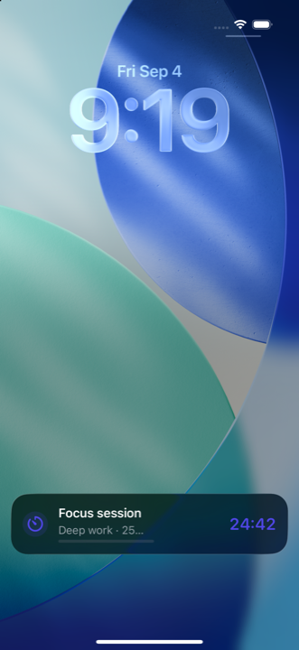
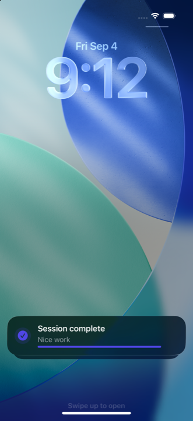
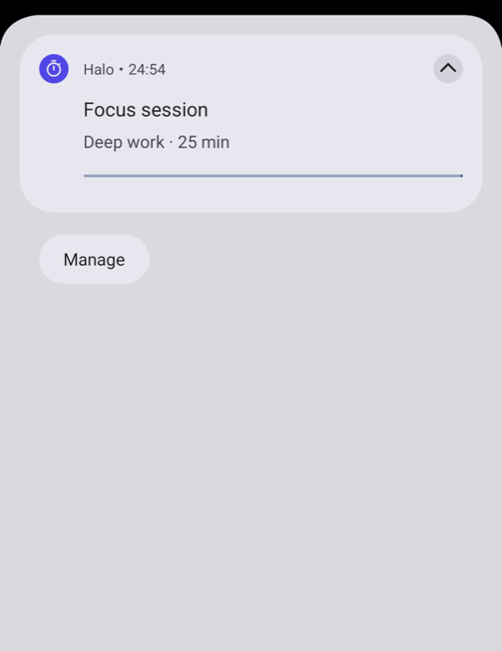
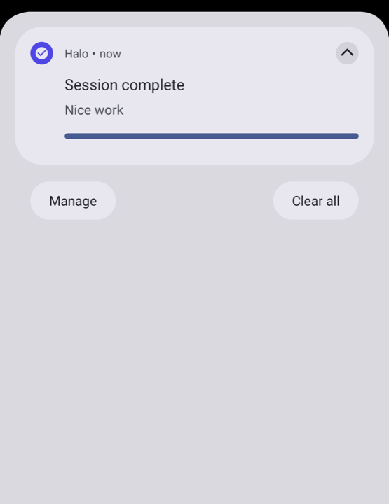

<h1 align="center">Halo</h1>

<p align="center"><b>One API. Lock Screen, Dynamic Island, and Android Live Updates.</b></p>

<p align="center">
  <a href="https://central.sonatype.com/artifact/io.github.androidpoet/halo"></a>
  <a href="https://kotlinlang.org"></a>
  <a href="LICENSE"></a>
</p>

<p align="center">
  
  
  
  
  
</p>

<p align="center">
Start, update and end a live activity from <code>commonMain</code>. iOS renders it with
<b>ActivityKit</b> on the Lock Screen and in the Dynamic Island; Android renders it as an
<b>Android 16 Live Update</b> (promoted ongoing notification with progress and a ticking
chronometer), falling back to a plain ongoing notification on older versions.
</p>

## Screenshots

<table align="center">
  <tr>
    <th>iOS Lock Screen</th>
    <th>iOS ended</th>
    <th>Android 16 Live Update</th>
    <th>Android ended</th>
  </tr>
  <tr>
    <td></td>
    <td></td>
    <td></td>
    <td></td>
  </tr>
</table>

The default iOS widget and the Android notification are both driven by the same
`LiveActivityContent`: title, subtitle, icon, accent colour, progress and a timer that
ticks natively on each platform without per-second updates.

## Install

```kotlin
implementation("io.github.androidpoet:halo:0.1.0")          // core API + platform managers
implementation("io.github.androidpoet:halo-compose:0.1.0")  // rememberLiveActivityManager()
```

## Usage

```kotlin
val liveActivities = rememberLiveActivityManager()

val now = Clock.System.now().toEpochMilliseconds()
val request =
    LiveActivityRequest(
        content =
            LiveActivityContent(
                title = "Focus session",
                subtitle = "Deep work",
                progress = LiveActivityProgress.Determinate(current = 0, max = 25),
                timer = LiveActivityTimer(startAtEpochMillis = now, endAtEpochMillis = now + 25 * 60_000L),
                icon = "timer",
                accentColorArgb = 0xFF4F46E5,
            ),
        deepLink = "myapp://focus",
    )

when (val result = liveActivities.start(request)) {
    is LiveActivityResult.Success -> sessionId = result.value.id
    is LiveActivityResult.Failure -> show(result.error.code, result.error.message)
}

liveActivities.update(sessionId, content.copy(subtitle = "Almost there"))
liveActivities.end(sessionId, finalContent = content.copy(title = "Session complete"))
```

The timer ticks on its own on both platforms. Call `update` only when the content changes.

## Platforms

| Platform | Surface | Floor | One-time setup |
| --- | --- | --- | --- |
| Android | Live Update (promoted ongoing notification) on Android 16; ongoing notification below | API 26 | Request `POST_NOTIFICATIONS` on API 33+ |
| iOS | Lock Screen + Dynamic Island via ActivityKit | iOS 16.2 | Widget extension, `NSSupportsLiveActivities`, Swift package, bridge file (below) |
| JVM, macOS, Wasm | `UnsupportedLiveActivityManager` so shared code compiles | — | — |

### Android

```kotlin
Halo.androidConfig =
    AndroidLiveActivityConfig(
        smallIconRes = R.drawable.ic_timer,
        iconResolver = { key -> if (key == "timer") R.drawable.ic_timer else 0 },
    )
```

Icons are resolved through `iconResolver` at compile time, never by resource name, so
shrunk release builds keep working. `AndroidLiveActivityManager.canPromote` and
`isPromotable(id)` tell you whether the system will show the status-bar chip.

### iOS

ActivityKit is Swift-only, so three small pieces live on the Swift side:

1. **Swift package** `swift/HaloKMP` — add it to **both** the app target and the
   widget extension. It holds `HaloActivityAttributes` (the one attributes type ActivityKit
   matches on; never copy it) and `HaloActivityWidget`, a ready-made Lock Screen +
   Dynamic Island UI.
2. **Widget extension** — a `WidgetBundle` whose body is `HaloActivityWidget()`. Add
   `NSSupportsLiveActivities = YES` to the app's `Info.plist`.
3. **Bridge file** — copy `swift/HaloBridge.swift` into the app target, point its
   import at your Kotlin framework, and register it at launch:

```swift
Halo.shared.register(bridge: HaloBridge())
```

Export the library from your framework so Swift sees the bridge types by name:

```kotlin
binaries.framework { export(project(":halo")) }   // plus api(...) in commonMain
```

Want your own look? Write an `ActivityConfiguration(for: HaloActivityAttributes.self)` and
read `context.state` (title, subtitle, progress, timer range, `values`).

## Things to know

- **iOS ends activities after 8 hours.** They surface as `LiveActivityState.Expired`; the library
  never restarts them for you.
- **One slot for the chip.** `shortText` replaces the ticking timer in the status-bar chip and the
  Dynamic Island compact view. Leave it null to show the timer.
- **Payload cap.** Encoded requests over 3 KB fail with `PayloadTooLarge`; ActivityKit's ceiling is
  about 4 KB.
- **Restore.** Activities still on screen after process death come back in `activities` with their
  content, on both platforms. Nothing survives a reboot on Android.
- **Android `Default` dismissal** keeps the final card as a normal, swipeable notification for up to
  four hours (best effort; some OEMs ignore timeouts). Use `Immediate` to remove it now.

### Troubleshooting

| Symptom | Cause |
| --- | --- |
| iOS: `start` succeeds, nothing renders | The attributes type is duplicated across targets. Link the Swift package from both targets; do not copy `HaloActivityAttributes`. |
| iOS: `Unsupported` | Bridge not registered, or iOS < 16.2. Register at app init. |
| Android: no status-bar chip | Pre-Android 16, `canPostPromotedNotifications()` false, or `shortText` and timer both absent. |

## Sample

`sample/composeApp` is one shared screen (Start, +5 min, Pause, Finish). Android:
`./gradlew :sample:composeApp:installDebug`. iOS: `cd sample/composeApp/iosApp && xcodegen && open iosApp.xcodeproj`.

## License

MIT © Ranbir Singh
